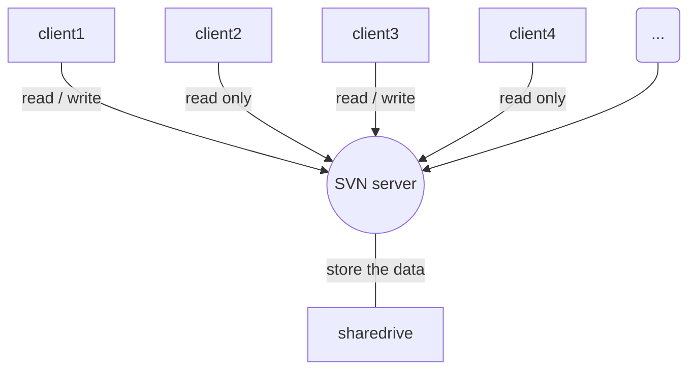

### 商品分享流程

userid|proid|商品名称
--|:--:|--:
9|69|柠檬
9|65|橘子
9|58|双面绒
>这是引用的内容
>>这是引用的内容
>>>这是引用的内容
---
----
***
*****
[超链接](http://jianshu.com)

```flow
### 这是三级标题
st=>start: 微信小程序分享流程
e=>end: 购买 
op1=>operation: 发起分享
op2=>operation: 分享给朋友
op3=>operation: 点击链接
op4=>operation: 循环结束 
 
cond1=>condition: 选择分享方式
cond2=>condition: 判断循环条件
io1=>inputoutput: 输入密码
结束 
 
st->op1->cond1
cond1(yes, right)->op2(right)->io1->cond2
cond1(no,left)->op3(right)->cond2
cond2(yes)->op3->cond2


```
```flow 
st=>start: 开始 
e=>end: 登录 
io1=>inputoutput: 输入用户名密码 
sub1=>subroutine: 数据库查询子类 
cond=>condition: 是否有此用户 
cond2=>condition: 密码是否正确 
op=>operation: 读入用户信息

st->io1->sub1->cond 
cond(yes,right)->cond2 
cond(no)->io1(right) 
cond2(yes,right)->op->e 
cond2(no)->io1 


开始 
st=>start: 开始
操作 
op1=>operation: 操作、执行说明
条件 
cond=>condition: 确认？
子程序 
sub1=>subroutine: 子程序操作说明
用户输入或输出 
io1=>inputoutput: 输入密码
结束 
e=>end: 结束



123

```sequence
Title:连接建立的过程
客户主机->服务器主机: 连接请求（SYN=1,seq=client_isn） 
服务器主机->客户主机: 授予连接（SYN=1,seq=client_isn）\n ack=client_isn+1
客户主机->服务器主机: 确认（SYN=0,seq=client_isn+1）\nack=server_isn+1
```　


 participant 客户端
    participant 控制器
    participant 业务
    participant 数据库
    
     客户端->数据库:提交数据店铺
     Note right of 客户端:提交数据进行验证
     控制器->控制器:验证数据完整性
     Note left of 控制器:返回错误的字段信息
     控制器-->客户端:数据不完整
     Note over 客户端: 用户输入通行证的账号、密码
     控制器->业务:保存店铺到数据库
     业务->业务:save店铺数据
     业务-->控制器:保存出现异常
     控制器-->客户端:保存成功
     数据库-->业务:success
     业务-->控制器:success
     控制器-->客户端:success 客户端
     Note left of 控制器:返回正确的提示，并跳转到审核第二步
     
